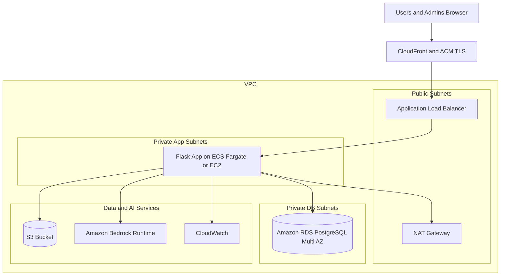
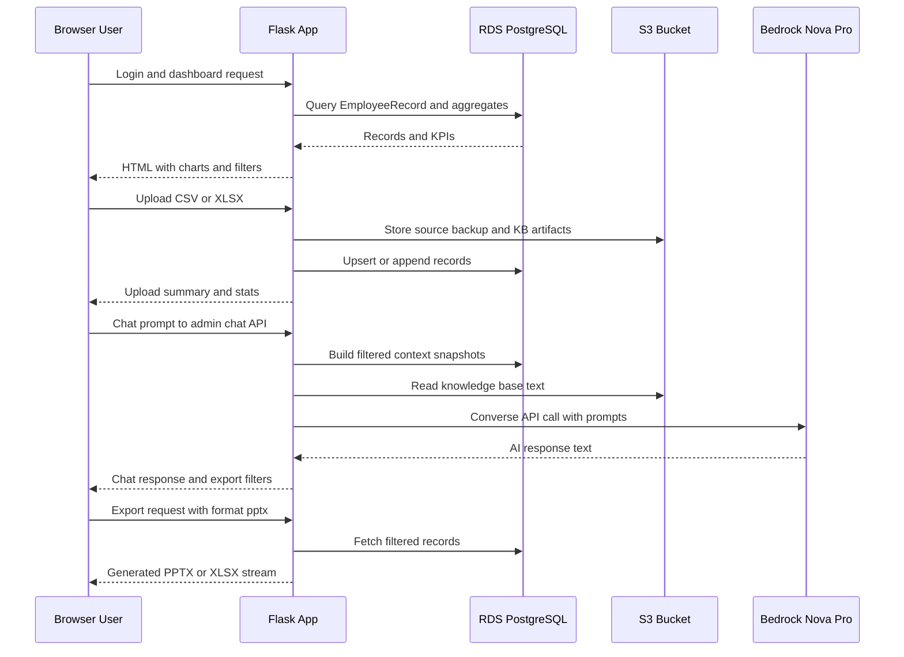

# AI Academy Tracker – AWS Architecture (RDS-Centric)

This document provides a deployable AWS architecture diagram for the current Flask-based codebase with Amazon RDS PostgreSQL as the primary data store.

## 1) High-level deployment diagram

## 2) Runtime flow diagram (how requests move)

## 3) AWS services mapping to current code

- **Flask app runtime**: Gunicorn entrypoint creates the app and registers routes.
- **RDS PostgreSQL (primary system of record)**: SQLAlchemy URI built from `RDS_*` env vars.
- **S3 usage**: uploads, backups, knowledge-base text, and voice processing artifacts.
- **Bedrock**: chat responses via `bedrock-runtime.converse`.
- **PPTX generation**: built in-app with `python-pptx` (not QuickSight).

## 4) Recommended production topology

- **Compute**: ECS Fargate service (2+ tasks, autoscaling) behind ALB.
- **Database**: RDS PostgreSQL Multi-AZ with backups + Performance Insights.
- **Static/session/security**:
  - TLS at CloudFront/ALB with ACM cert.
  - Secrets in AWS Secrets Manager (DB creds, app secrets).
  - Security groups: ALB -> App SG only; App SG -> RDS SG only.
- **Storage**:
  - Dedicated S3 bucket with lifecycle policies.
  - SSE-S3 or SSE-KMS encryption.
- **Observability**:
  - CloudWatch Logs for app containers.
  - ALB access logs and 4xx/5xx alarms.
  - RDS CPU/connections/storage alarms.

## 5) Minimal environment variables for deployment

- `RDS_HOSTNAME`, `RDS_PORT`, `RDS_DB_NAME`, `RDS_USERNAME`, `RDS_PASSWORD`
- `SECRET_KEY`, `ADMIN_USERNAME`, `ADMIN_PASSWORD`
- `AWS_REGION`, `S3_BUCKET_NAME`
- Bedrock settings: `BEDROCK_ENABLED`, `BEDROCK_MODEL_ID`

## 6) Notes for hardening before go-live

- Remove default hard-coded fallback credentials.
- Put app/admin auth behind stronger IdP or SSO if possible.
- Add WAF on CloudFront/ALB.
- Restrict egress where feasible; use VPC endpoints for S3/Bedrock if supported in your setup.
